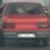
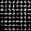
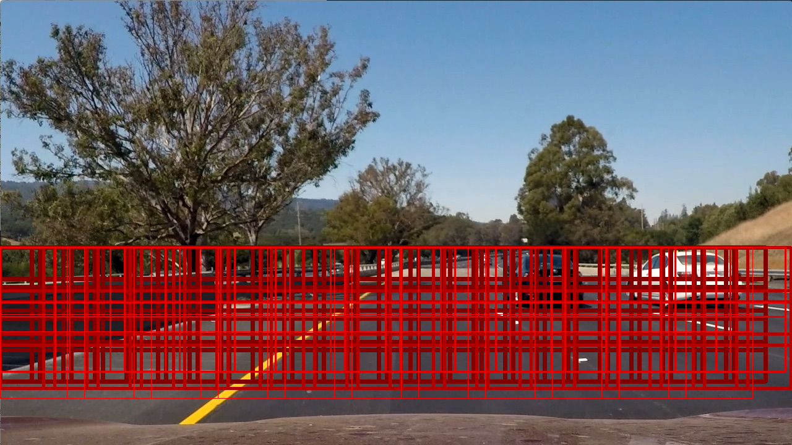
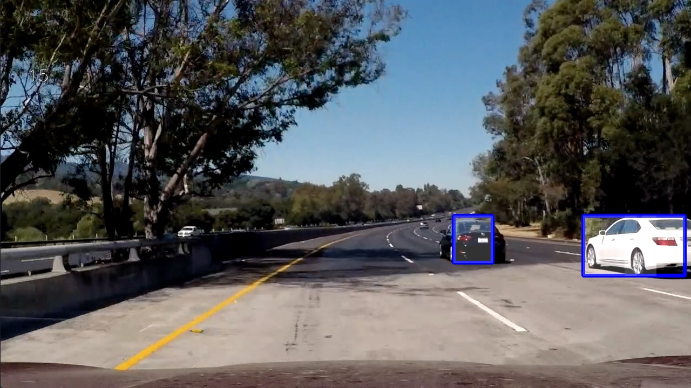
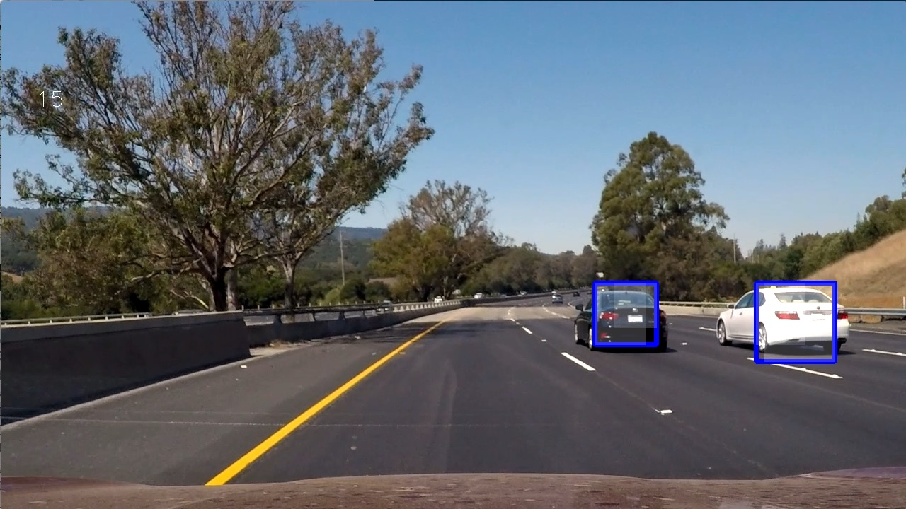
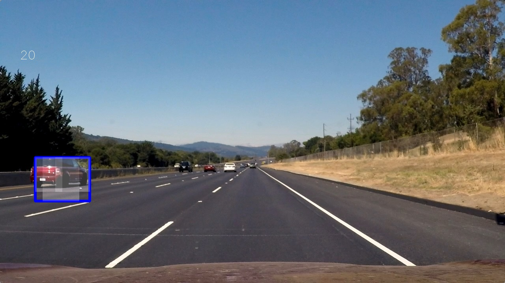

# **Advanced Lane Finding Project / Vehicle Tracking**
[](http://www.udacity.com/drive)
[](https://codeclimate.com/github/avrabe/CarND-Advanced-Lane-Lines)
[](https://travis-ci.org/avrabe/CarND-Advanced-Lane-Lines)

## Vehicle Detection Project

The goals / steps of this project are the following:

* Perform a Histogram of Oriented Gradients (HOG) feature extraction on a labeled training set of images and train a classifier Linear SVM classifier
* Optionally, you can also apply a color transform and append binned color features, as well as histograms of color, to your HOG feature vector.
* Note: for those first two steps don't forget to normalize your features and randomize a selection for training and testing.
* Implement a sliding-window technique and use your trained classifier to search for vehicles in images.
* Run your pipeline on a video stream (start with the test_video.mp4 and later implement on full project_video.mp4) and create a heat map of recurring detections frame by frame to reject outliers and follow detected vehicles.
* Estimate a bounding box for vehicles detected.


## [Rubric](https://review.udacity.com/#!/rubrics/513/view) Points
---

### Histogram of Oriented Gradients (HOG)

#### Extract HOG features from the training images

I started in function [model](vehicle.py#L356) which calls the function [create_model](vehicle.py#L279). There the vehicle and not-vehicle files are put together. These are handed over to [extract_features](vehicle.py#L107) which extracts from every image and flipped image the features via the function [features_features_features](vehicle.py#L148). Finally this calls the function [get_hog_features](vehicle.py#L28) which extracts the hog features using the function [skimage.hog](http://scikit-image.org/docs/dev/api/skimage.feature.html#skimage.feature.hog)

An example for the vehicle and not vehicle is:

| Vehicle       | Not vehicle          |
|:-------------:|:--------------------:|
|||

I've tested a bit with the parameters of the HOG features. An example hog image using the final parameters is shown below.

| HOG           |
|:-------------:|
||

#### Final HOG parameters

The final parameters for HOG are:

```python
colorspace = Color.YCrCb
hog_channel = "ALL"
orientation = 10
pix_per_cell = (8, 8)
cell_per_blocks = (2, 2)
```

I've tested through all options of the colorspace and hog_channel and tried an orientation from 8 to 12 and pix_per_cell from (6, 6) to (10, 10) and cell_per_blocks from (1, 1) to (3, 3) and the above final parameters turned out to create the best accuracy for the SVM classifier (**Test Accuracy of SVC = 0.993000**).

The linear SVM is trained in function [create_model](vehicle.py#L279) in line [317](vehicle.py#L317). It uses as feature vector the combination of hog features, bin spatial features and color histogram features which had been [scaled](vehicle.py#L303). In addition the data was split into a training and test set.

###Sliding Window Search

I mainly used the sliding window example provided in the class. In addition I limited the search range (see below picture)

| Search window |
|:-------------:|
||

Furthermore I added 4 different scales of the sliding window and further played with the parameters (the overlap between each window is 20% in x and y). Limiting the search scope was done by looking at the picture itself (don't track the sky). The overlap was tested by looking at the resulting test images and videos.


<br>


<br>

---

### Video Implementation

Here's a link to my final video which also include the lane detection from P4.

<a href="https://github.com/avrabe/CarND-Advanced-Lane-Lines/blob/master/output_images/output_full_0_project_video.mp4?raw=true">
<br>
Output video
</a>

I've tracked the positions of positive detection for each video frame. In addition I stored the detection of the last 5 frames. Afterwards I created the heatmap using the previously and new detected positions. The further the detection was in the past, the less weight the detection got to the final heatmap. Afterwards the heatmap was thresholded. I then used `scipy.ndimage.measurements.label()` to identify individual blobs in the heatmap.  I then assumed each blob corresponded to a vehicle.  I constructed bounding boxes to cover the area of each blob detected.

The video already shows the final resulting bounding box. Inside there is in additional an overlayed output of the thresholded heatmap.


---

###Discussion

####1. Briefly discuss any problems / issues you faced in your implementation of this project.  Where will your pipeline likely fail?  What could you do to make it more robust?

Once I've set in place the pipeline, there was already some detection working. In the previous projects this was not always the case. So using the hog features, SVM and sliding windows worked good out of the box. However when it comes to fine tuning, the same as with the previous projects applies. It would be really helpful if I'd added some code which would log each step of the pipeline as small changes can have big differences in the output.

If I'd have to work further on the project I'd:
- Add a better visualization of each stage of the pipeline.
- Improve the detection rate of the SVC classifier. Even with 99.3% accuracy that means that in every frame there is the possibility that wrong predictions are made. I'd would extend the amount of vehicle and not vehicle in the first place.
- First to enhance the lane finding algorithm to detect all lanes and to use this input to further limit the sliding window.
- Try to reduce the wobbling of the cars.
- Try to enhance the detection of two cars (if the drive close by). Currently it only detects one.
- Further work to detect cars far up (The white car is for some time not detected)
- Further rework after term2 once we also have lidar data to further rationalize the detected cars.

The pipeline might already fail when trucks and motorcycles are on the road since I've not trained them.
