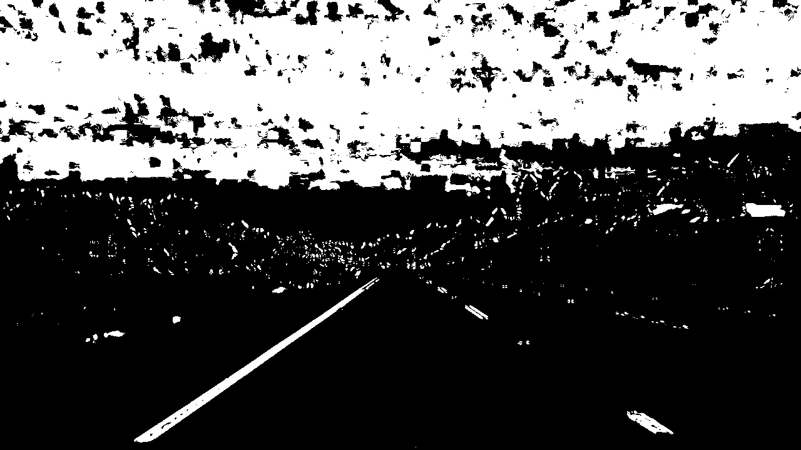

# **Advanced Lane Finding Project**
[](http://www.udacity.com/drive)
[](https://codeclimate.com/github/avrabe/CarND-Advanced-Lane-Lines)
[](https://travis-ci.org/avrabe/CarND-Advanced-Lane-Lines)

## The Project
The goals / steps of this project are the following:

* Compute the camera calibration matrix and distortion coefficients given a set of chessboard images.
* Apply a distortion correction to raw images.
* Use color transforms, gradients, etc., to create a thresholded binary image.
* Apply a perspective transform to rectify binary image ("birds-eye view").
* Detect lane pixels and fit to find the lane boundary.
* Determine the curvature of the lane and vehicle position with respect to center.
* Warp the detected lane boundaries back onto the original image.
* Output visual display of the lane boundaries and numerical estimation of lane curvature and vehicle position.

## Project setup

The project uses a similar approach as [Keras](https://keras.io/) to create the model pipeline. Each operation (e.g. undistort or warp the image) is modelled as Layer which can be stacked. In addition the Layers can be sequenced sequentially or parallel (with an optional merge layer). Below the class diagram:

<a href="model_class.png">

</a>

> In the implementation interfaces are implemented
> via [duck typing](https://en.wikipedia.org/wiki/Duck_typing)

### Camera Calibration

#### Create calibration pattern points

I start by preparing "object points", which will be the (x, y, z) coordinates of the chessboard corners in the world. Here I am assuming the chessboard is fixed on the (x, y) plane at z=0, such that the object points are the same for each calibration image.  Thus, `objp` is just a replicated array of coordinates, and `objpoints` will be appended with a copy of it every time I successfully detect all chessboard corners in a test image.  `imgpoints` will be appended with the (x, y) pixel position of each of the corners in the image plane with each successful chessboard detection.

The function [calibrate_camera(files)](lane/camera/__init__.py#L13) implements this.

#### Calibrate the camera and undistort images

The calibration pattern points `objpoints` and `imgpoints` are used as input for the [`Undistort`](lane/camera/__init__.py#L44) Layer. If necessary, the layer will call `cv2.calibrateCamera()`to compute the camera calibration and distortion coefficients. Using this information, the undistortion function  `cv2.undistort()` is called and the undistorted image returned.

Below image example can be implemented with following code.

```python
from lane.camera import Undistort, calibrate_camera
from lane.image import FileImage
files = "camera_cal/*.jpg"
image = FileImage("camera_cal/calibration1.jpg")
model = Undistort(calibrate=calibrate_camera(files)
undistorted_image = model.call(image)
```


| Original                                                                                | Undistorted                                                                                |
|:------------------------------------------------------------------------------------:|:---------------------------------------------------------------------------------------:|
|||

The application also can be used with following command line:

```bat
python sobel.py images -i camera_cal\calibration1.jpg -o output_images -m undistort
```


### Pipeline (single images)

The full image pipeline model can be seen below.

<a href="model.png">

</a>

In the following the important steps within the pipeline will be outlined in detail.

#### Undistort
As described above in the camera calibration section, the undistortion on images is the first step in the pipeline. The same code as above can be used. Next an example using the test images can be seen.

| Original                                                      | Undistorted                                                                              |
|:-------------------------------------------------------------:|:--------------------------------------------------------------------------------------------:|
|  | |

The application can be used with following command line:

```bat
python sobel.py images -i test_images/test5.jpg -o output_images -m undistort
```

#### GaussianBlur and Threshold

To create the binary images, the image first was blurred using gaussian blur ([`GaussianBlur`](lane/image/__init__.py#L158) Layer). Afterwards a color threshold ([`ColorChannel_Threshold`](lane/threshold/__init__.py#L12) Layer) and absolute sobel threshold ([`Absolute_Sobel_Threshold`](lane/threshold/__init__.py#L65) Layer) was used. The merge of the layers was done using the [`Merge_Threshold`](lane/threshold/__init__.py#L128) Layer.

The concrete implementation of the configuration is done in the function [`binary_threshold()`](sobel.py#L15).

The value and saturation channel have been used as well as the x and y absolute sobel threshold.

Below image example can be implemented with following code.

```python
from lane.camera import Undistort, calibrate_camera
from lane.image import FileImage
files = "camera_cal/*.jpg"
image = FileImage("test_images/test5.jpg")

def binary_threshold(smooth=True):
    color_parallel = Parallel(merge=Merge_Threshold(merge="(('v' >= 1) & ('s' >= 1))", binary=True, name="color"),
                              name="color_threshold")
    color_parallel.add(ColorChannel_Threshold(name="v", color_channel=ColorChannel.VALUE, threshold=(150, 255)))
    color_parallel.add(ColorChannel_Threshold(name="s", color_channel=ColorChannel.SATURATION, threshold=(100, 255)))
    parallel = Parallel(merge=Merge_Threshold(merge="(('gradx' >= 1) & ('grady' >= 1) | ('color' >= 1))", binary=False),
                        name="thresholds")
    parallel.add(color_parallel)
    parallel.add(Absolute_Sobel_Threshold(name="gradx", orient='x', threshold=(50, 255)))
    parallel.add(Absolute_Sobel_Threshold(name="grady", orient='y', threshold=(25, 255)))
    return parallel

model = Sequential()
model.add(Undistort(calibrate=calibrate_camera(files))
model.add(GaussianBlur())
model.add(binary_threshold())
thresholded_image = model.call(image)
```

| Undistorted                                                      | Thresholded                                                                              |
|:-------------------------------------------------------------:|:--------------------------------------------------------------------------------------------:|
|  | |

The application can be used with following command line:

```bat
python sobel.py images -i test_images/test5.jpg -o output_images -m undistort_threshold
```

#### Warp

The perspective transformation is implemented in the [`Warp`](lane/image/__init__.py#L195) Layer). It is used in the function [`full_model()`](sobel.py#L41).

The Warp Layer can be configured using the with of the top and the bottom as well as the height of the trapezoid and how much of the bottom should be trimmed (to remove parts of the car). In addition an offset can be added to the destination.

The source and destination points are defined therefore as:

```
call_offset = w * self.offset
src = np.array([[w * (.5 - self.mid_width / 2), h * self.height_pct],
                [w * (.5 + self.mid_width / 2), h * self.height_pct],
                [w * (.5 + self.bot_width / 2), h * self.bottom_trim],
                [w * (.5 - self.bot_width / 2), h * self.bottom_trim]],
               dtype=np.float32
dst = np.array([[call_offset, 0],
                [w - call_offset, 0],
                [w - call_offset, h],
                [call_offset, h]],
               dtype=np.float32)
```

When the Warp layer is called, the inverse operation is stored as meta information in the returned image. A [`Unwarp`](lane/image/__init__.py#L256) Layer) could then reuse this inverse operation to transform the image back into it's original perspective.

The following two lines added to the example in "GaussianBlur and Threshold" will warp the image.

```python
...
model.add(Warp())
warped_image = model.call(image)
```

I verified that my perspective transform was working as expected by drawing the `src` and `dst` points onto a test image and its warped counterpart to verify that the lines appear parallel in the warped image.

| Thresholded                                                      | Warped                                                                              |
|:-------------------------------------------------------------:|:--------------------------------------------------------------------------------------------:|
|  | |

The application can be used with following command line:

```bat
python sobel.py images -i test_images/straight_lines1.jpg -o output_images -m undistort_threshold_warp
```

#### 4. Describe how (and identify where in your code) you identified lane-line pixels and fit their positions with a polynomial?

Then I did some other stuff and fit my lane lines with a 2nd order polynomial kinda like this:


| Warped                                                      | Lane Lines (blind search)                                                                            |
|:-------------------------------------------------------------:|:--------------------------------------------------------------------------------------------:|
|  | |

| Warped                                                      | Lane Lines (one eyed search)                                                                              |
|:-------------------------------------------------------------:|:--------------------------------------------------------------------------------------------:|
|  | |


#### 5. Describe how (and identify where in your code) you calculated the radius of curvature of the lane and the position of the vehicle with respect to center.

I did this in lines # through # in my code in `my_other_file.py`

#### 6. Provide an example image of your result plotted back down onto the road such that the lane area is identified clearly.

I implemented this step in lines # through # in my code in `yet_another_file.py` in the function `map_lane()`.  Here is an example of my result on a test image:


---

### Pipeline (video)

#### 1. Provide a link to your final video output.  Your pipeline should perform reasonably well on the entire project video (wobbly lines are ok but no catastrophic failures that would cause the car to drive off the road!).


<a href="https://github.com/avrabe/CarND-Advanced-Lane-Lines/blob/master/output_images/output_full_0_project_video.mp4?raw=true">
<br>
Output video
</a>

---

## Discussion

### 1. Briefly discuss any problems / issues you faced in your implementation of this project.  Where will your pipeline likely fail?  What could you do to make it more robust?

Here I'll talk about the approach I took, what techniques I used, what worked and why, where the pipeline might fail and how I might improve it if I were going to pursue this project further.


